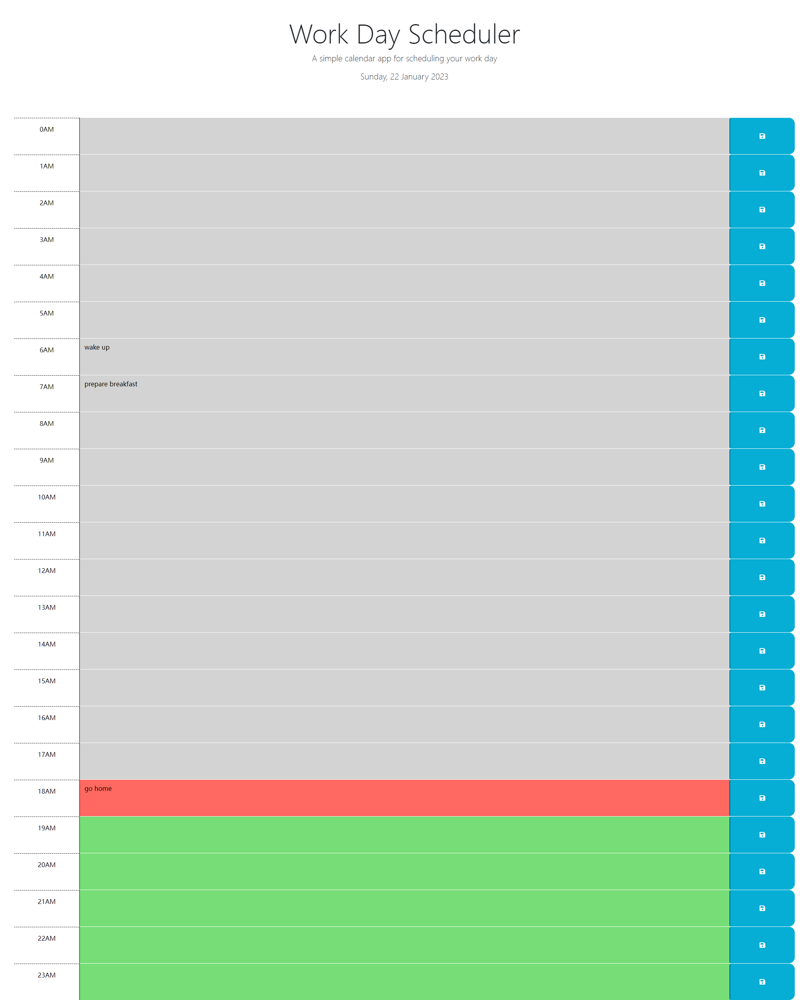

# WorkDayScheduler.github.io

The application can be used to record your plan for daily work 

The value will be stored into localstore.

When you reopen the link, the recoreded data will be filled automatically

The link is here:https://huyingg1.github.io/WorkDayScheduler.github.io/index.html

